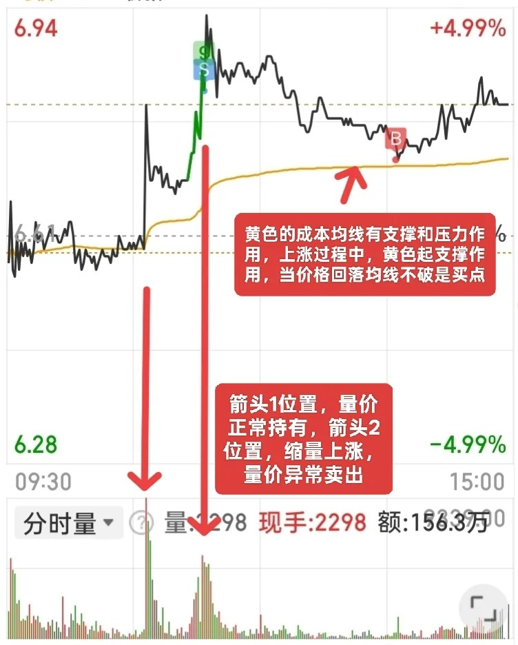

# 做T比全仓死拿赚

要是你想长期拿着一只股票，留50%当“底仓”。之后靠长期做T（当天买卖）来降成本。
 
1. 选对股票是前提：要挑那种业绩靠谱、还能稳步张的股票。
2. 做T技巧：盘中"T+0“。大跌的时候再买，盘中有赚赶紧卖。千万别追涨杀跌，不然当天就被套了。
3. 50%的底仓不能动，也不要随便换股。

做T方法：

1. 倒T：先卖再买。
2. 正T：先买再卖。

做倒T时机：

看分时线和5分钟K线，要是遇到”三个高“就该卖了：

1. 分时线里MACD的红柱特别高。
2. 5分钟K线里MACD的红柱也特别高。
3. 5分钟K线离均线特别远。

卖完后，等5分钟K线里MACD的红柱不缩短了，或者绿柱不长了。再趁低价买回来。

做正T的时机则相反。

# 做T的四大原则

1. 当价格下跌，但是均价线不跟可以低吸。当价格上涨，但是均价线也不跟，可以高抛。
2. 开盘后股价急跌5个点以上，而且（必须）越跌成交量越小。当价格远离均价线时可以低买等量的底仓。等股价反弹到均价线时卖出底仓做T。
3. 开盘后股价一直在低位震荡，但是没有跌破第一个低点。这时可以在再次出现低点时买入等量底仓，等股价冲高时卖出底仓做T。
4. 开盘10分钟股价急拉，但是没有涨停。这一般是主力诱多的陷阱，可以在冲高无力的时候卖出底仓做T，等到后面价格跳水的时候再买回底仓。

# 长期持有一只股票，坚持每天做T

分时做T要点：

1. 做T要大盘和个股分时线结合看，可以个股分时图叠加指数。
2. 开盘半个小时股价波动大，机会也多。中午和下午收盘前慎重做T，有主力就喜欢搞尾盘偷袭，容易被套。
3. 妖股、强势股和龙头股谨慎做T，容易做飞。跟风股可以参考龙头股的走势做T。

经典做T时机：

1. 股价上冲无量，大盘向下，看空。
2. 股价新高，MACD不新高（顶背离），大盘向下，看空。
3. 股价新低，MACD不新低（底背离），大盘向上，看多。
4. 股价在均价之上，回探均价，大盘向上，看多。
5. 股价在均价之下，上探均价，大盘向下，看空。

# 量价分析

当价格上涨得不到量能的支持时，表明上涨动力不足。这时应及时卖出，等到股价止跌企稳再接回来。

第一波价格上涨伴随量能的放大，这是健康的价格走势，但是第二波价格上涨，量能相比前一波量能却明显缩量，这种现象我们常叫做“量价背离”，这时候可以果断卖出！

黄色的均线有支撑和压力作用，且下跌无量又回踩黄色均线不破时，我们可以尝试买入。

# 5个做T口诀

1. 做T先看趋势，上升趋势多正T，下降趋势多反T，横盘震荡谨慎T。 
2. 早盘30分钟和尾盘30分钟，是做T的黄金窗口期，波动相对规律。 
3. 成交量是做T的晴雨表，缩量震荡少动，放量突破再进场。 
4. 大盘暴跌或突发利空时，暂停做T，规避系统性风险优先。 
5. 个股突发利好高开，别追高做正T，大概率会回落套牢。

# 仓位滚动法

简单说就是利用价格波动，底仓不动，用剩余一半的仓位在一支股票上反复低买高卖。永远不空仓，也永远不满仓。

1. 首先把资金分成10份，拿出4份作为自己的核心仓位（适中保持不动），剩下的6份用来滚动。
2. 设定网格交易，比如涨跌0.5%交易一次，当价格跌0.5%买一份，涨0.5%卖一份。
3. 同时设置最大最小仓位，防止超买和卖飞，基本保持核心50% + 滚动部分30%，这样大致总仓位可以控制在80%。
4. 注意单边行情下，要及时止盈止损，网格不是一成不变的。

# 看着MACD图做T

1. 出现红色朝上的柱体，然后两根线也在上面的时候，可以卖。
2. 出现绿色朝下的柱体，两个线在下面的时候，适合买。
